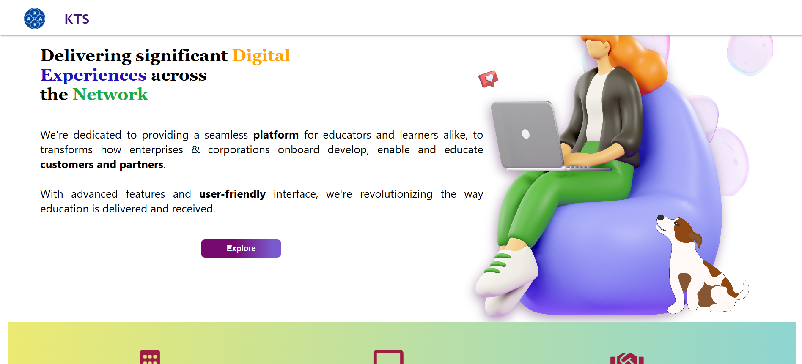

## Note
This site is not live anymore, but the repository remains as part of my portfolio.
This was developed during my time at a startup for real clients.  
Although the site is not deployed live anymore, this repository showcases the code, design, and development work I contributed.

# Athenna Lms
A digital learning platform designed for enterprises and educators, enabling seamless onboarding, training, and education with advanced features and user-friendly design.

## Tech Stack
- HTML
- CSS
- JavaScript
- Canva

## Features
- Responsive design
- User-friendly layout

## Project Context
Built as part of client projects at K-AKA Technology Services, focusing on delivering practical and visually appealing websites.

## Screenshots  
  
